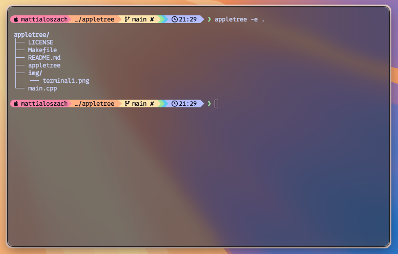
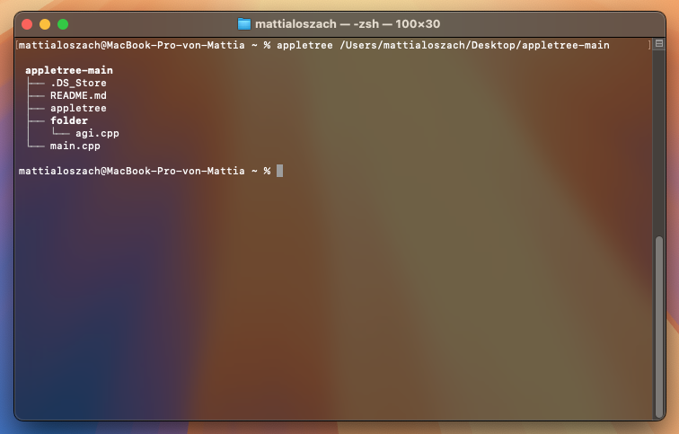

# appletree - A Simple Directory Tree Viewer 🍏🌳✨

'appletree' is a lightweight and efficient terminal-based directory tree viewer for macOS & Linux.  
It helps you visualize folder structures with optional file filtering.




## 📌 Features
- 📂 Display a tree-like structure of directories and files
- ❌ Exclude specific files or folders (`-e`)
- ✅ Show only selected files or folders (`-o`)
- 🔧 Designed for **macOS**
- ⚡ Fast and lightweight

---

## 📦 Installation

### Download the Repository
Clone the repository to your local machine:
```bash
git clone https://github.com/mattialosz/appletree.git
cd appletree
```

### Simple Installation using Makefile

- You can compile and install `appletree` locally using the provided `Makefile`:

```bash
make
sudo make install
```
The binary will be installed to /usr/local/bin/appletree by default


- To remove:
```bash
sudo make uninstall
```
### Further options:
To run without installing:
```bash
make run
```
Just create a binary:
```bash
make
```


### Compiling from Source 
If you prefer to compile the source code yourself, go to the folder and run:
```bash
g++ -std=c++17 -o appletree main.cpp
```
Now, you have an executable appletree that you can run.

If you are using older versions of the GCC compiler and encounter error messages related to the implementation of std::filesystem you can tell the linker about the right library by just adding a flag:
```bash
g++ -std=c++17 -o appletree main.cpp -lstdc++fs
```

## 🚀 Making Appletree Globally Accessible
### Local Execution
If you prefer to run appletree only in the current directory, simply navigate to its location and execute:
```bash
./appletree
```

### Global Installation (Recommended)
To make appletree available as a system-wide command, move it to /usr/local/bin/:
```bash
sudo mv appletree /usr/local/bin/
sudo chmod +x /usr/local/bin/appletree
```
Now, you can run appletree from anywhere by simply typing:
```bash
appletree
```

## 📖 Usage

- Simply open a terminal and run:
```bash
appletree
```


- Exclude Specific Files/Folders (example)
```bash
appletree -e node_modules
```
(This will exclude the node_modules folder from the output.)


- Exclude Hidden Files/Folders
```bash
appletree -e .
```
(This will automatically exclude all hidden files/folders from the output.)


- Show Only Selected Files/Folders (example)
```bash
appletree -o src include
```
(This will display only the src and include directories.)


- Display Help
```bash
appletree help
```
(Shows detailed usage instructions.)

## 📜 Example Output
```bash
 my_project
 ├── src
 │   ├── main.cpp
 │   ├── utils.h
 │   └── utils.cpp
 ├── include
 │   └── config.h
 ├── README.md
 └── Makefile
```

## 🚀 Contribute
Feel free to fork the repo, open issues, or submit pull requests! Contributions are always welcome.

## ⚠️ Updates
- This is the first version
- Updates/optimizations will follow soon
